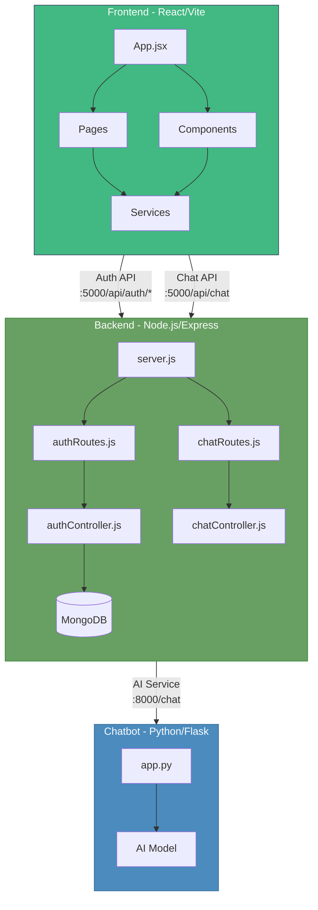
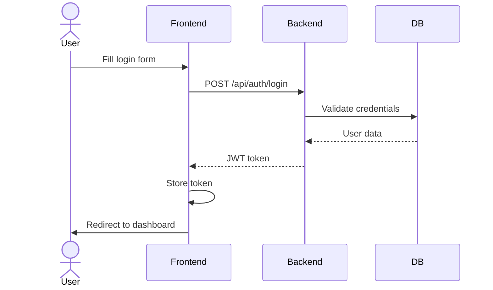
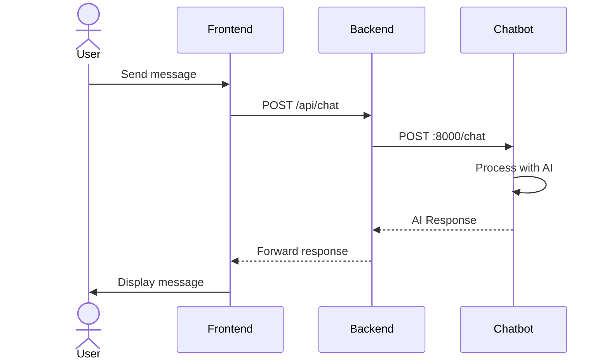

# Project Architecture - AI Lesson Plan Compliance Checker

This document outlines the complete architecture of the project, including frontend, backend API, and chatbot service interactions.

## System Components



## File Structure & Flow

### Frontend (`my-app/`)
```
my-app/
├── src/
│   ├── pages/
│   │   ├── Landing.jsx       # Landing page with features
│   │   ├── Login.jsx         # Login form
│   │   ├── Signup.jsx        # Signup form
│   │   ├── Home.jsx          # Dashboard after login
│   │   ├── Profile.jsx       # User profile management
│   │   └── chatbot.jsx       # Chatbot interface
│   │
│   ├── components/
│   │   ├── navbar.jsx        # Top navigation
│   │   ├── Sidebar.jsx       # Side navigation
│   │   ├── home/            
│   │   │   ├── activity.jsx  # Activity tracking
│   │   │   └── review.jsx    # Review component
│   │   ├── landing/
│   │   │   ├── feature.jsx   # Feature showcase
│   │   │   └── hero.jsx      # Hero section
│   │   └── profile/
│   │       ├── accountsetting.jsx
│   │       ├── profilecard.jsx
│   │       ├── recentactivity.jsx
│   │       └── savedplans.jsx
│   │
│   ├── services/
│   │   └── api.js            # Axios API client
│   │
│   ├── App.jsx              # Main app component
│   └── main.jsx             # Entry point
```

### Backend (`backend/`)
```
backend/
├── server.js                # Express server setup
├── routes/
│   ├── authroutes.js       # Auth endpoints
│   └── chatRoutes.js       # Chat endpoints
├── controller/
│   ├── authController.js   # Auth logic
│   └── chatController.js   # Chat forwarding
├── models/
│   └── user.js            # User schema
├── middleware/
│   └── authMiddleware.js  # JWT validation
└── config/
    └── db.js             # MongoDB connection
```

### Chatbot (`chatbot/`)
```
chatbot/
├── app.py                # Flask server
├── req.txt              # Python dependencies
└── __pycache__/         # Python cache
```

## API Flow & Endpoints

### Authentication Flow
1. User fills Login/Signup form
2. Frontend calls `/api/auth/login` or `/api/auth/signup`
3. Backend validates and creates/authenticates user
4. JWT token returned and stored in localStorage
5. User redirected to dashboard



### Chat Flow
1. User sends message in chat interface
2. Frontend sends to backend `/api/chat`
3. Backend forwards to Python service
4. Python AI processes and returns response
5. Response flows back to user



## Running the Project

1. Start MongoDB database
2. Start backend server (port 5000):
   ```bash
   cd backend
   npm install
   npm start
   ```

3. Start Python chatbot (port 8000):
   ```bash
   cd chatbot
   pip install -r req.txt
   python app.py
   ```

4. Start frontend dev server:
   ```bash
   cd my-app
   npm install
   npm run dev
   ```

## Security Notes

- Frontend stores JWT in localStorage as 'userInside'
- Backend validates JWT on protected routes
- CORS configured for local development
- Auth middleware protects sensitive endpoints

## Development Notes

- Frontend uses Vite + React + Tailwind
- Backend uses Express + MongoDB
- Chatbot uses Flask + AI model
- All services use environment variables for configuration